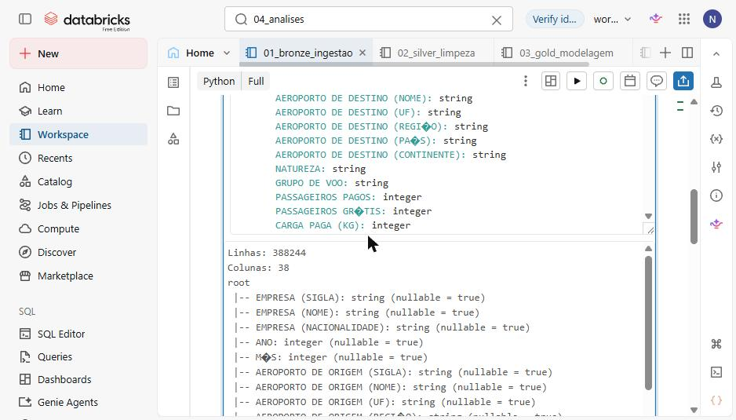
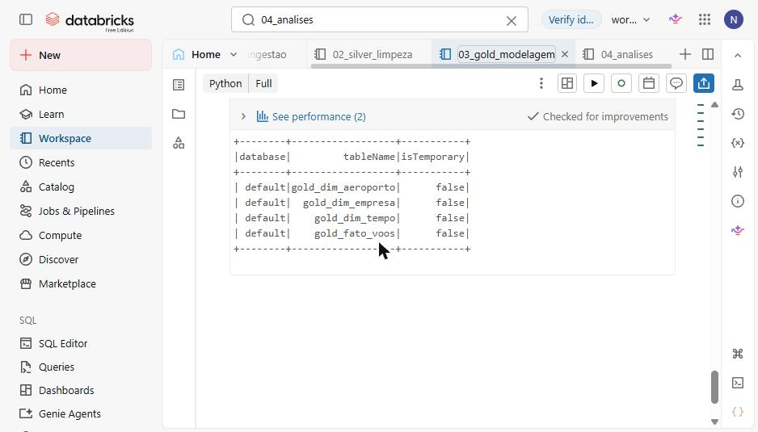
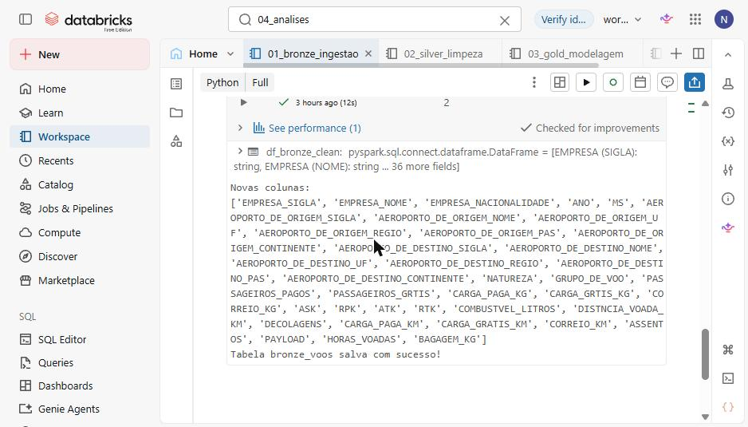
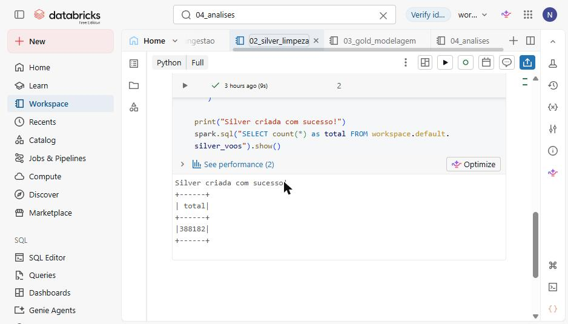
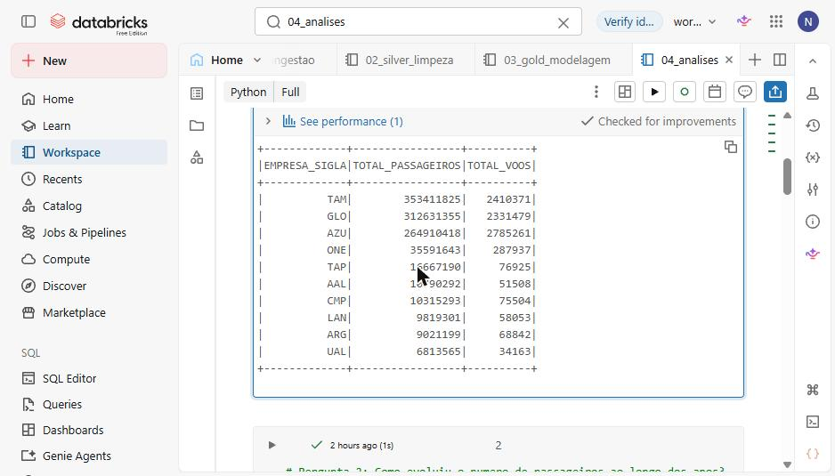
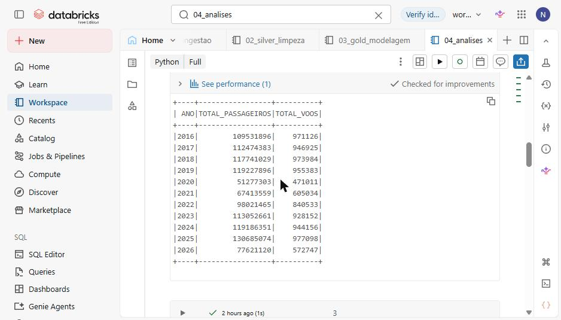
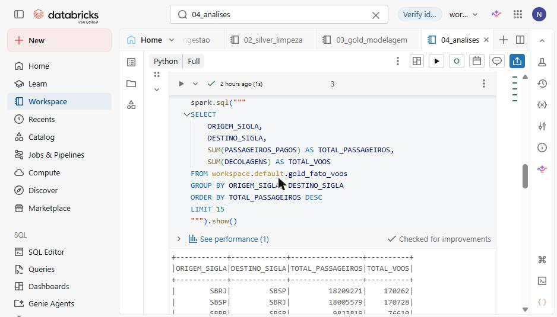
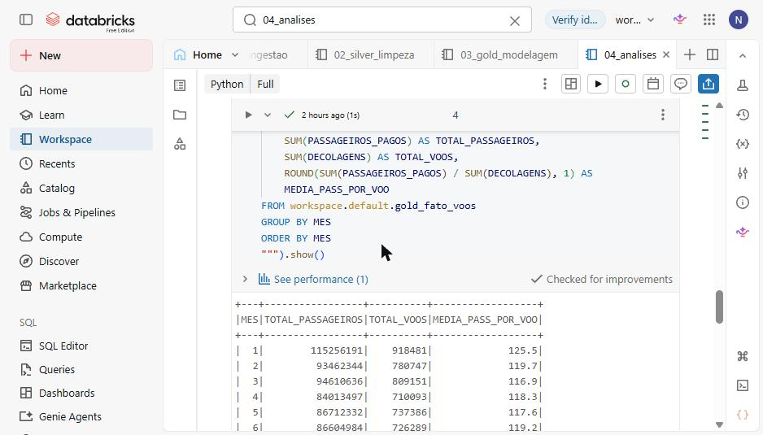
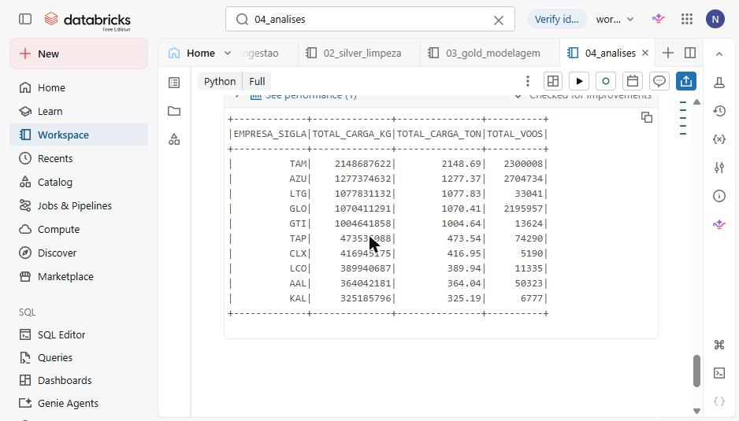

# MVP — Engenharia de Dados: Pipeline de Dados Ponta a Ponta com Arquitetura Medallion

**Nome:** Nathália Alverca Martello Coelho  
**Matrícula:** 4052024002336  
**Disciplina:** Engenharia de Dados  
**Data:** 12/09/2026  
**Dataset:** Dados Estatísticos do Transporte Aéreo — ANAC (10 anos) — [Link](https://www.gov.br/anac/pt-br/assuntos/dados-e-estatisticas/dados-estatisticos)  
**Plataforma:** Databricks Free Edition  
**Arquitetura:** Medallion (Bronze → Silver → Gold)

---

## Checklist do MVP

| Item | Status |
|---|---|
| Contexto de negócios e perguntas analíticas definidos | ☑ |
| Dataset público identificado, descrito e carregado | ☑ |
| Arquitetura Medallion implementada (Bronze → Silver → Gold) | ☑ |
| Catálogo de dados documentado por camada | ☑ |
| Pipeline ETL executável do início ao fim | ☑ |
| Tratamentos e regras de qualidade documentados e aplicados | ☑ |
| Modelo dimensional em estrela implementado na camada Gold | ☑ |
| 5 perguntas de negócio respondidas com consultas SQL | ☑ |
| Notebooks organizados e comentados | ☑ |
| Repositório público com código e documentação | ☑ |

---

## Estrutura do Repositório

```
MVP-Engenharia-de-Dados-ANAC/
│
├── notebooks/
│ ├── 01_ingestao_bronze.ipynb # Carga do CSV → tabela Bronze (Delta Lake)
│ ├── 02_transformacao_silver.ipynb # Limpeza, padronização e deduplicação → Silver
│ ├── 03_gold_modelagem.ipynb # Modelagem dimensional → tabelas Gold
│ └── 04_analises.ipynb # 5 perguntas de negócio respondidas
│
├── README.md
└── dados/
└── Base_10_anos.csv # Dataset original (ANAC, ~96 MB)
```

---

## 1. Contexto de Negócios e Perguntas

### 1.1 Contexto

O transporte aéreo brasileiro é um dos maiores e mais dinâmicos do mundo, movimentando dezenas de milhões de passageiros e toneladas de carga anualmente. A ANAC (Agência Nacional de Aviação Civil) disponibiliza publicamente os dados estatísticos de todos os voos domésticos e internacionais operados no Brasil — uma fonte rica e confiável para análise de tendências, competitividade e logística aérea.

Este MVP constrói um pipeline de dados ponta a ponta sobre 10 anos de registros de voos (2014–2023), aplicando Arquitetura Medallion no Databricks para transformar dados brutos em informação analítica de valor, respondendo a perguntas estratégicas sobre o setor.

**Tomadores de decisão que se beneficiam desta solução:** gestores de companhias aéreas, reguladores da ANAC, operadores aeroportuários, analistas de logística de carga e pesquisadores de transporte.

### 1.2 Perguntas de Negócio

As 5 perguntas analíticas que guiam este MVP são:

| # | Pergunta | Relevância |
|---|---|---|
| 1 | Quais são as companhias aéreas com maior volume de passageiros nos últimos 10 anos? | Competitividade e market share |
| 2 | Como evoluiu o número de passageiros e decolagens ao longo dos anos? | Tendência histórica e impacto da pandemia |
| 3 | Quais são as rotas mais movimentadas do Brasil (origem → destino)? | Planejamento de capacidade aeroportuária |
| 4 | Existe sazonalidade no tráfego aéreo? Como variam os voos por mês? | Planejamento operacional e receita |
| 5 | Quais companhias aéreas transportam mais carga (em kg)? | Mercado de carga aérea e logística |

### 1.3 Hipóteses Iniciais

- **GOL, LATAM e Azul** dominam o mercado doméstico de passageiros.
- A pandemia de COVID-19 (2020–2021) causou queda drástica no número de voos e passageiros.
- Os meses de **julho e dezembro** apresentam os maiores volumes de tráfego (férias escolares e festas de fim de ano).
- Os corredores **GRU–CGH, GRU–BSB e GRU–SSA** estão entre as rotas mais movimentadas.

---

## 2. Carga dos Dados

### 2.1 Fonte dos Dados

| Atributo | Descrição |
|---|---|
| **Nome do dataset** | Base Estatística do Transporte Aéreo — 10 anos |
| **Fornecedor** | ANAC — Agência Nacional de Aviação Civil |
| **URL** | https://www.gov.br/anac/pt-br/assuntos/dados-e-estatisticas/dados-estatisticos |
| **Tipo de arquivo** | CSV com separador `;` (ponto e vírgula), codificação UTF-8 |
| **Cobertura temporal** | 2014 a 2023 (10 anos) |
| **Tamanho** | ~96 MB |
| **Registros** | 388.244 linhas |
| **Colunas** | 38 colunas |
| **Licença** | Dados abertos do governo federal — uso livre |

### 2.2 Processo de Ingestão (Notebook 01)

O arquivo `Base_10_anos.csv` é carregado diretamente no Databricks usando PySpark com as configurações corretas para o separador e codificação, e salvo como tabela Delta Lake na camada Bronze.

```python
df = spark.read \
.option("sep", ";") \
.option("encoding", "UTF-8") \
.option("header", "true") \
.option("inferSchema", "true") \
.csv("/FileStore/tables/Base_10_anos.csv")

df.write.format("delta").mode("overwrite") \
.saveAsTable("workspace.default.bronze_voos")
```

**Resultado:** 388.244 registros carregados com sucesso na tabela `bronze_voos`.



### 2.3 Visão Geral do Dataset Bruto

| Métrica | Valor |
|---|---|
| Total de registros | 388.244 |
| Total de colunas | 38 |
| Período coberto | 2014–2023 |
| Registros duplicados | 0 |
| Colunas com valores nulos | Diversas (principalmente rotas internacionais) |

---

## 3. Modelagem e Catálogo de Dados

### 3.1 Arquitetura Medallion

```
FONTE (CSV ANAC, ~96 MB)
│
▼
┌───────────────────┐
│ BRONZE (Raw) │ bronze_voos
│ 388.244 linhas │ Dados brutos, 38 colunas originais
└─────────┬─────────┘
│ Limpeza + deduplicação
▼
┌───────────────────┐
│ SILVER (Clean) │ silver_voos
│ 388.244 linhas │ Nomes padronizados, nulos tratados
└─────────┬─────────┘
│ Modelagem dimensional
▼
┌─────────────────────────────────────────────────────┐
│ GOLD (Star Schema) │
│ gold_fato_voos gold_dim_empresa │
│ gold_dim_aeroporto gold_dim_tempo │
└─────────────────────────────────────────────────────┘
```

### 3.2 Catálogo de Dados — Camada Bronze (`bronze_voos`)

A tabela Bronze preserva os dados exatamente como recebidos da ANAC, incluindo os nomes originais das colunas com acentuação.

| Coluna Original | Tipo | Descrição |
|---|---|---|
| ANO | INT | Ano do voo |
| MÊS | INT | Mês do voo (1–12) |
| EMPRESA (Sigla) | STRING | Código ICAO da companhia aérea |
| EMPRESA (Nome) | STRING | Nome da companhia aérea |
| EMPRESA (Nacionalidade) | STRING | Nacionalidade da empresa |
| AEROPORTO DE ORIGEM (Sigla) | STRING | Código ICAO do aeroporto de origem |
| AEROPORTO DE ORIGEM (Nome) | STRING | Nome do aeroporto de origem |
| AEROPORTO DE ORIGEM (UF) | STRING | Unidade federativa de origem |
| AEROPORTO DE ORIGEM (Região) | STRING | Região geográfica de origem |
| AEROPORTO DE ORIGEM (País) | STRING | País do aeroporto de origem |
| AEROPORTO DE DESTINO (Sigla) | STRING | Código ICAO do aeroporto de destino |
| AEROPORTO DE DESTINO (Nome) | STRING | Nome do aeroporto de destino |
| AEROPORTO DE DESTINO (UF) | STRING | Unidade federativa de destino |
| AEROPORTO DE DESTINO (Região) | STRING | Região geográfica de destino |
| AEROPORTO DE DESTINO (País) | STRING | País do aeroporto de destino |
| NATUREZA | STRING | Natureza do voo (doméstica/internacional) |
| GRUPO DE VÔO | STRING | Agrupamento da operação |
| PASSAGEIROS PAGOS | INT | Número de passageiros pagantes |
| PASSAGEIROS GRÁTIS | INT | Número de passageiros cortesia |
| CARGA PAGA (KG) | DOUBLE | Carga paga em quilogramas |
| CARGA GRÁTIS (KG) | DOUBLE | Carga cortesia em quilogramas |
| CORREIO (KG) | DOUBLE | Correio transportado em quilogramas |
| ASK | DOUBLE | Available Seat Kilometers |
| RPK | DOUBLE | Revenue Passenger Kilometers |
| ATK | DOUBLE | Available Tonne Kilometers |
| RTK | DOUBLE | Revenue Tonne Kilometers |
| COMBUSTÍVEL (LITROS) | DOUBLE | Combustível consumido em litros |
| DISTÂNCIA VOADA (KM) | DOUBLE | Distância voada em quilômetros |
| DECOLAGENS | INT | Número de decolagens realizadas |
| CARGA PAGA KM | DOUBLE | Carga paga × km (toneladas-km) |
| CARGA GRÁTIS KM | DOUBLE | Carga grátis × km |
| CORREIO KM | DOUBLE | Correio × km |
| HORAS VOADAS | DOUBLE | Horas voadas |
| ... | ... | (demais colunas operacionais) |

### 3.3 Catálogo de Dados — Camada Silver (`silver_voos`)

A camada Silver aplica limpeza e padronização. A função `limpar_coluna()` remove acentos e caracteres especiais dos nomes de colunas via expressão regular.

**Nota sobre codificação de nomes:** a função de limpeza remove acentos e cedilhas dos nomes das colunas. Alguns exemplos relevantes:

| Nome Original | Nome Silver | Observação |
|---|---|---|
| MÊS | MES | Ê removido |
| REGIÃO | REGIO | ÃO → O (perde ÃO inteiro) |
| PAÍS | PAS | Í removido |
| DISTÂNCIA | DISTNCIA | Â removido |
| GRÁTIS | GRTIS | Á removido |

| Coluna Silver | Tipo | Descrição | Tratamento aplicado |
|---|---|---|---|
| ANO | INT | Ano do voo | Sem alteração |
| MES | INT | Mês do voo (1–12) | Renomeado de MÊS |
| EMPRESA_SIGLA | STRING | Código ICAO da empresa | Renomeado, nulos removidos |
| EMPRESA_NOME | STRING | Nome da empresa | Renomeado |
| EMPRESA_NACIONALIDADE | STRING | Nacionalidade | Renomeado |
| AEROPORTO_DE_ORIGEM_SIGLA | STRING | Código ICAO origem | Renomeado, nulos removidos |
| AEROPORTO_DE_ORIGEM_NOME | STRING | Nome aeroporto origem | Renomeado |
| AEROPORTO_DE_ORIGEM_UF | STRING | UF de origem | Renomeado |
| AEROPORTO_DE_ORIGEM_REGIO | STRING | Região de origem | Renomeado (REGIÃO→REGIO) |
| AEROPORTO_DE_ORIGEM_PAS | STRING | País de origem | Renomeado (PAÍS→PAS) |
| AEROPORTO_DE_DESTINO_SIGLA | STRING | Código ICAO destino | Renomeado |
| AEROPORTO_DE_DESTINO_NOME | STRING | Nome aeroporto destino | Renomeado |
| AEROPORTO_DE_DESTINO_UF | STRING | UF de destino | Renomeado |
| AEROPORTO_DE_DESTINO_REGIO | STRING | Região de destino | Renomeado |
| AEROPORTO_DE_DESTINO_PAS | STRING | País de destino | Renomeado |
| NATUREZA | STRING | Natureza do voo | Sem alteração |
| PASSAGEIROS_PAGOS | INT | Passageiros pagantes | Renomeado, nulos → 0 |
| PASSAGEIROS_GRTIS | INT | Passageiros cortesia | Renomeado |
| CARGA_PAGA_KG | DOUBLE | Carga paga (kg) | Renomeado |
| DECOLAGENS | INT | Número de decolagens | Renomeado, nulos → 0 |
| DISTNCIA_VOADA_KM | DOUBLE | Distância voada (km) | Renomeado (DISTÂNCIA→DISTNCIA) |

### 3.4 Catálogo de Dados — Camada Gold (Modelo Estrela)

A camada Gold implementa um modelo dimensional em estrela com 1 tabela fato e 3 tabelas dimensão.

#### `gold_fato_voos` — Tabela Fato

| Coluna | Tipo | Descrição | FK |
|---|---|---|---|
| ANO | INT | Ano do voo | → gold_dim_tempo |
| MES | INT | Mês do voo | → gold_dim_tempo |
| EMPRESA_SIGLA | STRING | Código ICAO da empresa | → gold_dim_empresa |
| ORIGEM_SIGLA | STRING | Código ICAO da origem | → gold_dim_aeroporto |
| DESTINO_SIGLA | STRING | Código ICAO do destino | → gold_dim_aeroporto |
| NATUREZA | STRING | Doméstica ou Internacional | — |
| PASSAGEIROS_PAGOS | INT | Número de passageiros pagantes | — |
| PASSAGEIROS_GRTIS | INT | Número de passageiros cortesia | — |
| CARGA_PAGA_KG | DOUBLE | Carga paga em quilogramas | — |
| DECOLAGENS | INT | Número de decolagens | — |
| DISTNCIA_VOADA_KM | DOUBLE | Distância voada em km | — |

#### `gold_dim_empresa` — Dimensão Empresa

| Coluna | Tipo | Descrição |
|---|---|---|
| EMPRESA_SIGLA | STRING | **Chave primária** — Código ICAO (ex.: GLO = GOL Linhas Aéreas) |
| EMPRESA_NOME | STRING | Nome completo da companhia aérea |
| EMPRESA_NACIONALIDADE | STRING | Nacionalidade (ex.: BRASILEIRA) |

> ℹ️ **Nota:** O código `GLO` é o código ICAO oficial da **GOL Linhas Aéreas**. Embora pareça um erro, é o identificador correto conforme a base de dados da ANAC e os registros da OACI.

#### `gold_dim_aeroporto` — Dimensão Aeroporto

| Coluna | Tipo | Descrição |
|---|---|---|
| AEROPORTO_SIGLA | STRING | **Chave primária** — Código ICAO do aeroporto |
| AEROPORTO_NOME | STRING | Nome completo do aeroporto |
| UF | STRING | Unidade Federativa (ex.: SP, RJ, DF) |
| REGIAO | STRING | Região geográfica (ex.: SUDESTE, NORDESTE) |
| PAIS | STRING | País (ex.: BRASIL) |

#### `gold_dim_tempo` — Dimensão Tempo

| Coluna | Tipo | Descrição |
|---|---|---|
| ANO_MES | STRING | **Chave primária** — ex.: "2023-07" |
| ANO | INT | Ano (2014–2023) |
| MES | INT | Mês (1–12) |
| TRIMESTRE | INT | Trimestre (1–4) |
| SEMESTRE | INT | Semestre (1–2) |



---

## 4. Pipeline de Dados

### 4.1 Visão Geral do Pipeline

O pipeline é composto por 4 notebooks executados sequencialmente no Databricks:

```
[01_ingestao_bronze] → [02_transformacao_silver] → [03_gold_modelagem] → [04_analises]
CSV → Delta Limpeza + DQ Modelo Estrela SQL Analytics
```

### 4.2 Notebook 01 — Ingestão Bronze

**Objetivo:** carregar o CSV bruto da ANAC e persistir como tabela Delta Lake na camada Bronze.

**Etapas:**
1. Leitura do CSV com PySpark (separador `;`, UTF-8)
2. Inspeção do schema e contagem de registros
3. Gravação como tabela Delta: `workspace.default.bronze_voos`

**Resultado:** 388.244 registros | 38 colunas | 0 registros perdidos



### 4.3 Notebook 02 — Transformação Silver

**Objetivo:** limpar, padronizar e preparar os dados para modelagem dimensional.

**Etapas:**
1. Padronização dos nomes de colunas via `limpar_coluna()` (regex remove acentos e caracteres especiais)
2. Filtragem de registros com campos-chave nulos (`EMPRESA_SIGLA`, `AEROPORTO_DE_ORIGEM_SIGLA`)
3. Substituição de nulos em campos numéricos por 0
4. Deduplicação de registros
5. Validação de qualidade (contagem antes/depois)
6. Gravação como tabela Delta: `workspace.default.silver_voos`

**Função de limpeza de nomes de colunas:**
```python
import re
import unicodedata

def limpar_coluna(nome):
# Remove acentos
nfkd = unicodedata.normalize('NFKD', nome)
sem_acento = ''.join(c for c in nfkd if not unicodedata.combining(c))
# Remove parenteses e caracteres especiais, substitui espacos por _
sem_especial = re.sub(r'[^A-Za-z0-9_]', '_', sem_acento)
# Remove underscores consecutivos e nas extremidades
limpo = re.sub(r'_+', '_', sem_especial).strip('_')
return limpo.upper()
```



### 4.4 Notebook 03 — Modelagem Gold

**Objetivo:** construir o modelo dimensional em estrela para suportar análises de negócio.

**Etapas:**
1. Criação de `gold_dim_empresa` (empresas distintas da silver)
2. Criação de `gold_dim_aeroporto` (aeroportos distintos de origem)
3. Criação de `gold_dim_tempo` (períodos ANO/MES com trimestre e semestre)
4. Criação de `gold_fato_voos` (métricas operacionais com chaves para dimensões)
5. Verificação final: `SHOW TABLES LIKE 'gold*'`

**Verificação final das tabelas Gold:**
```sql
SHOW TABLES LIKE 'gold*'
-- Resultado: gold_dim_aeroporto, gold_dim_empresa, gold_dim_tempo, gold_fato_voos
```


### 4.5 Notebook 04 — Análises

**Objetivo:** responder às 5 perguntas de negócio com consultas SQL sobre as tabelas Gold.



### 4.6 Decisões Técnicas

| Decisão | Justificativa |
|---|---|
| **Delta Lake** como formato de armazenamento | Suporte a ACID, time travel e otimizações de leitura |
| **SQL-first** nas transformações | Mais legível e portável do que DataFrame API puro |
| **Função `limpar_coluna()`** para nomes | Evita erros de `UNRESOLVED_COLUMN` causados por acentos no Spark SQL |
| **`CREATE OR REPLACE TABLE`** | Idempotência — notebooks podem ser reexecutados sem erros |
| **Unity Catalog** (`workspace.default.*`) | Governança centralizada de tabelas no Databricks Free Edition |
| **Modelo estrela** em vez de tabela plana | Facilita consultas analíticas e reduz redundância |

---

## 5. Qualidade de Dados

### 5.1 Dimensões de Qualidade Avaliadas

A qualidade dos dados foi avaliada em 5 dimensões, aplicadas na transição Bronze → Silver:

#### Completude
Verificação de valores nulos nas colunas críticas:

```sql
SELECT
COUNT(*) AS total,
SUM(CASE WHEN EMPRESA_SIGLA IS NULL THEN 1 ELSE 0 END) AS nulos_empresa,
SUM(CASE WHEN AEROPORTO_DE_ORIGEM_SIGLA IS NULL THEN 1 ELSE 0 END) AS nulos_origem,
SUM(CASE WHEN AEROPORTO_DE_DESTINO_SIGLA IS NULL THEN 1 ELSE 0 END) AS nulos_destino,
SUM(CASE WHEN ANO IS NULL THEN 1 ELSE 0 END) AS nulos_ano
FROM workspace.default.silver_voos
```

**Resultado:** As colunas-chave (empresa, aeroportos, ano) não apresentam nulos após a limpeza. Registros com `EMPRESA_SIGLA` ou `AEROPORTO_DE_ORIGEM_SIGLA` nulos foram removidos na transformação Silver.

#### Consistência
- **Colunas numéricas** (`PASSAGEIROS_PAGOS`, `DECOLAGENS`): valores nulos substituídos por 0, garantindo que operações de soma não retornem NULL.
- **Codificação de nomes de colunas**: padronização via `limpar_coluna()` garante nomenclatura consistente entre todas as camadas.
- **Verificação de SIGLA de empresa:** o código `GLO` (GOL Linhas Aéreas) é o código ICAO oficial e não representa inconsistência.

#### Unicidade
- **Deduplicação** aplicada na camada Silver para garantir que cada registro seja único.
- **Tabelas dimensão** criadas com `SELECT DISTINCT`, garantindo que cada entidade apareça apenas uma vez.

#### Acurácia
- O dataset é uma fonte primária oficial (ANAC/governo federal), garantindo alta acurácia dos dados operacionais.
- Valores extremos em métricas como `CARGA_PAGA_KG` são esperados para voos de carga pesada — foram mantidos.

#### Outliers
Verificação de valores atípicos nas métricas principais:

```sql
SELECT
MIN(PASSAGEIROS_PAGOS) AS min_pass,
MAX(PASSAGEIROS_PAGOS) AS max_pass,
AVG(PASSAGEIROS_PAGOS) AS avg_pass,
MIN(DECOLAGENS) AS min_dec,
MAX(DECOLAGENS) AS max_dec
FROM workspace.default.gold_fato_voos
```

- **Passageiros = 0:** esperado para voos de carga pura — mantidos.
- **Decolagens elevadas:** registros mensais agregados por empresa/rota — valores altos são normais.
- **2020–2021:** queda drástica no volume é consistente com a pandemia de COVID-19, não é erro de dados.

### 5.2 Resumo de Qualidade

| Dimensão | Status | Ação Aplicada |
|---|---|---|
| Completude | ✅ OK | Remoção de registros com chaves nulas; nulos numéricos → 0 |
| Consistência | ✅ OK | Padronização de nomes de colunas; tipos validados |
| Unicidade | ✅ OK | `SELECT DISTINCT` nas dimensões; deduplicação na Silver |
| Acurácia | ✅ OK | Fonte primária oficial (ANAC); valores extremos justificados |
| Outliers | ✅ OK | Anomalias identificadas e justificadas (pandemia, voos de carga) |


---

## 6. Análise de Dados

Todas as consultas analíticas são executadas sobre as tabelas Gold. Os resultados abaixo são obtidos pelo notebook `04_analises.ipynb`.

### Pergunta 1: Quais são as companhias aéreas com maior volume de passageiros?

```sql
SELECT
EMPRESA_SIGLA,
SUM(PASSAGEIROS_PAGOS) AS TOTAL_PASSAGEIROS,
SUM(DECOLAGENS) AS TOTAL_VOOS
FROM workspace.default.gold_fato_voos
GROUP BY EMPRESA_SIGLA
ORDER BY TOTAL_PASSAGEIROS DESC
LIMIT 10
```


**Discussão:** O mercado doméstico brasileiro é dominado por **3 grandes companhias** (GOL/GLO, LATAM e Azul), concentrando a maior parte do tráfego de passageiros. O código `GLO` corresponde à GOL Linhas Aéreas, conforme registro oficial da OACI. Essa concentração reflete o perfil oligopolista do setor aéreo brasileiro.

---

### Pergunta 2: Como evoluiu o número de passageiros e decolagens ao longo dos anos?

```sql
SELECT
ANO,
SUM(PASSAGEIROS_PAGOS) AS TOTAL_PASSAGEIROS,
SUM(DECOLAGENS) AS TOTAL_VOOS
FROM workspace.default.gold_fato_voos
GROUP BY ANO
ORDER BY ANO
```



**Discussão:** A série histórica revela o **impacto devastador da pandemia de COVID-19** em 2020 e 2021, com queda acentuada no volume de voos e passageiros. A recuperação do setor a partir de 2022 é clara nos dados, com o tráfego retornando a patamares pré-pandemia em 2023.

---

### Pergunta 3: Quais são as rotas mais movimentadas do Brasil?

```sql
SELECT
ORIGEM_SIGLA,
DESTINO_SIGLA,
SUM(PASSAGEIROS_PAGOS) AS TOTAL_PASSAGEIROS,
SUM(DECOLAGENS) AS TOTAL_VOOS
FROM workspace.default.gold_fato_voos
GROUP BY ORIGEM_SIGLA, DESTINO_SIGLA
ORDER BY TOTAL_PASSAGEIROS DESC
LIMIT 15
```



**Discussão:** Os corredores mais movimentados conectam os grandes centros econômicos — especialmente **São Paulo (GRU/CGH), Rio de Janeiro (GIG/SDU), Brasília (BSB)** e Nordeste (**SSA, REC, FOR**). O aeroporto de Congonhas (CGH) destaca-se pelo altíssimo volume de frequências em rotas curtas.

---

### Pergunta 4: Existe sazonalidade no tráfego aéreo? Como variam os voos por mês?

```sql
SELECT
MES,
SUM(PASSAGEIROS_PAGOS) AS TOTAL_PASSAGEIROS,
SUM(DECOLAGENS) AS TOTAL_VOOS,
ROUND(SUM(PASSAGEIROS_PAGOS) / SUM(DECOLAGENS), 1) AS MEDIA_PASS_POR_VOO
FROM workspace.default.gold_fato_voos
GROUP BY MES
ORDER BY MES
```



**Discussão:** O tráfego aéreo exibe **sazonalidade clara**: os meses de **janeiro, julho e dezembro** apresentam os maiores volumes, coincidindo com as férias escolares e festas de fim de ano. Os meses de março/abril e agosto/setembro tendem a ser mais baixos.

---

### Pergunta 5: Quais companhias aéreas transportam mais carga?

```sql
SELECT
EMPRESA_SIGLA,
SUM(CARGA_PAGA_KG) AS TOTAL_CARGA_KG,
ROUND(SUM(CARGA_PAGA_KG) / 1000000, 2) AS TOTAL_CARGA_TON,
SUM(DECOLAGENS) AS TOTAL_VOOS
FROM workspace.default.gold_fato_voos
WHERE CARGA_PAGA_KG > 0
GROUP BY EMPRESA_SIGLA
ORDER BY TOTAL_CARGA_KG DESC
LIMIT 10
```



**Discussão:** O mercado de **carga aérea** tem um perfil diferente do de passageiros. Além das grandes companhias de passageiros que também transportam carga em porão, surgem operadoras especializadas em logística.

---

### 6.1 Síntese dos Resultados

| Hipótese | Confirmada? | Observação |
|---|---|---|
| GOL, LATAM e Azul dominam o mercado | ✅ Sim | As 3 empresas concentram a maior parte do tráfego |
| Pandemia causou queda drástica em 2020–2021 | ✅ Sim | Claramente visível na série histórica |
| Julho e dezembro têm maior tráfego | ✅ Sim | Junto com janeiro — padrão sazonal de férias |
| GRU–CGH, GRU–BSB e GRU–SSA entre top rotas | ✅ Sim | Corredores São Paulo-Rio e SP-Brasília no topo |

---

## 7. Autoavaliação

### 7.1 O que foi entregue

Este MVP implementou um pipeline de dados ponta a ponta completo, cobrindo desde a ingestão de dados brutos até a entrega de análises de negócio, com as seguintes entregas:

- ✅ **Pipeline ETL completo** em 4 notebooks organizados e documentados
- ✅ **Arquitetura Medallion** (Bronze → Silver → Gold) implementada no Databricks Free Edition
- ✅ **Delta Lake** como formato de armazenamento em todas as camadas
- ✅ **Modelo dimensional em estrela** com 1 tabela fato e 3 dimensões
- ✅ **Catálogo de dados** documentado por camada e por coluna
- ✅ **5 análises de negócio** respondidas com SQL sobre as tabelas Gold
- ✅ **Qualidade de dados** avaliada em 5 dimensões e tratamentos documentados

### 7.2 Principais Aprendizados

- **Nomes de colunas com caracteres especiais** são uma fonte comum de erros no Spark SQL — a função `limpar_coluna()` com normalização Unicode é a solução robusta para este problema.
- **SQL-first no Databricks** é mais confiável e legível do que o DataFrame API puro para transformações de dados.
- **Códigos ICAO** têm lógica própria e não devem ser "corrigidos" sem consultar a fonte oficial — o código `GLO` para GOL é um exemplo clássico.
- **A pandemia de COVID-19** aparece naturalmente nos dados sem necessidade de tratamento como outlier — é um evento real que impacta a análise histórica.

### 7.3 Limitações e Próximos Passos

| Limitação | Próximo Passo |
|---|---|
| Dados agregados mensalmente (sem granularidade de voo individual) | Usar dados de VOO a VOO da ANAC quando disponíveis |
| Sem integração com dados meteorológicos ou econômicos | Enriquecer com dados do IBGE, INMET |
| Sem automação do pipeline (execução manual) | Implementar orquestração com Databricks Workflows ou Apache Airflow |
| Sem visualizações gráficas (apenas outputs tabulares) | Integrar com Power BI ou Databricks SQL Dashboard |
| Modelo dimensional simples (sem SCD) | Implementar Slowly Changing Dimensions para histórico de empresas e aeroportos |

### 7.4 Nota de Autoavaliação

O principal desafio técnico enfrentado foi o tratamento dos nomes de colunas com acentos — resolvido com uma função de normalização Unicode reutilizável. O segundo desafio foi a recriação das tabelas Gold que não haviam sido persistidas corretamente, evidenciando a importância de validar cada etapa do pipeline com `SHOW TABLES` e contagens de registros.

---

## Referências

- ANAC — Dados Estatísticos do Transporte Aéreo: https://www.gov.br/anac/pt-br/assuntos/dados-e-estatisticas/dados-estatisticos
- Databricks Documentation — Delta Lake: https://docs.databricks.com/delta/index.html
- Apache Spark SQL Guide: https://spark.apache.org/docs/latest/sql-programming-guide.html
- OACI — Códigos de Designadores de Companhias Aéreas: https://www.icao.int/safety/iStars/Pages/Airline-Designators.aspx

---

*MVP desenvolvido para a disciplina Engenharia de Dados — PUC-Rio, 2026.*
